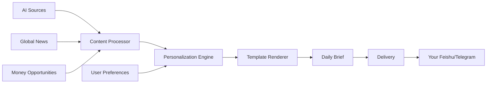

# 🌅 Personalized Morning Brief for AI Product Managers

**Wake up to AI insights, global news, and money-making opportunities - customized just for you.**

[](https://github.com/huangyixing520-tech/morning-brief-skill/stargazers)
[](https://opensource.org/licenses/MIT)
[](https://docs.openclaw.ai)

<div align="center">
  <!-- Placeholder for demo image - Replace with actual screenshot -->
  
  <br>
  <em>Your AI-powered morning routine starts here</em>
</div>

## 🎯 What Problem Does This Solve?

As an **AI Product Manager**, your morning is precious. You need to:
- 📈 **Stay ahead** on AI breakthroughs and tech trends
- 🌍 **Monitor global markets** that impact your products  
- 💰 **Spot money-making opportunities** before others
- 🎯 **Focus on what matters** to your specific role

But scanning news sites, Twitter, and reports takes **30+ minutes every morning**. 

**Our solution?** An AI-powered morning brief that:
- ✅ **Learns your preferences** (AI focus? Startup news? Investment opportunities?)
- ✅ **Aggregates from 15+ sources** in seconds
- ✅ **Delivers before your first coffee** (8 AM sharp)
- ✅ **Adapts over time** based on your feedback

## 🚀 One-Minute Setup

### Interactive Installation
```bash
# Clone and configure in one command
git clone https://github.com/huangyixing520-tech/morning-brief-skill.git
cd morning-brief-skill
./init.sh  # This asks about your preferences!
```

### What Happens During Setup?
The system will ask you:
1. **Your name and occupation** (AI Product Manager, Founder, Investor, etc.)
2. **Your interests** (AI, startups, tech investments, etc.)
3. **Your money focus** (product opportunities, investments, side hustles)
4. **Content priorities** (rate AI news vs global news vs money opportunities)
5. **Delivery preferences** (time, frequency, platform)

**Result**: A completely personalized morning routine starting tomorrow.

## 📊 Sample Output: AI Product Manager Edition

Here's what you'll receive every morning:

```
🤖 AI FRONTIER DYNAMICS
  • OpenAI unveils new multimodal model with video generation
  • AI chip startup raises $50M - market implications
  • 3 new AI product launches worth analyzing

🌍 GLOBAL BRIEF  
  • Fed holds rates steady - tech stock impact
  • EU passes new AI regulation - compliance checklist
  • Asian markets show strength in AI stocks

💰 MONEY OPPORTUNITIES
  • Untapped niche: AI-powered customer support for SMBs ($200M market)
  • Investment trend: VC pouring into AI infrastructure
  • Side hustle idea: AI newsletter with sponsorship potential

🎯 TODAY'S ACTION PLAN
  1. Research the new OpenAI model's API capabilities
  2. Draft competitor analysis for the AI chip startup
  3. Sketch MVP for the SMB customer support tool
```

## 🛠️ How It Works

### Data Collection Pipeline


### Sources Include:
- **AI News**: TechCrunch AI, 36氪 AI, arXiv最新论文, Twitter AI trends
- **Global News**: Bloomberg, Reuters, BBC Technology, 界面新闻  
- **Money Opportunities**: Crunchbase, SaaStr, Indie Hackers, Product Hunt
- **Plus**: Custom sources you add based on your interests

### Personalization Engine
The system learns from:
1. **Your explicit preferences** (setup questions)
2. **Your implicit feedback** (which links you click)
3. **Your career evolution** (changing interests over time)

## 👥 Who Is This For?

### Perfect For:
- **🤖 AI Product Managers** - Stay on top of tech and spot opportunities
- **🚀 Startup Founders** - Monitor competition and funding trends
- **📈 Investors** - Track market movements and emerging sectors
- **💼 Professionals** - Curate industry-specific intelligence
- **🎓 Students/Researchers** - Follow academic and industry developments

### Real User Stories:
> "As an AI PM, I was spending 45 minutes each morning reading news. Now I get everything I need in 2 minutes. Spotted 3 product opportunities in the first week!" - *OneStar, AI Product Manager*

> "The money opportunities section helped me identify a side project that now makes $2k/month. Best morning routine investment ever." - *Early User*

## 🔧 Customization Options

### Content Tailoring
```bash
# After installation, you can adjust:
./scripts/update-preferences.sh

# Or just tell your AI assistant:
"Add more deep tech analysis to my brief"
"Focus less on global news, more on AI"
"Include weather forecasts"
```

### Delivery Options
- **Platforms**: Feishu (default), Telegram, Email, Slack
- **Timing**: Any time you want (8 AM default)
- **Frequency**: Daily, Weekdays, Custom schedule
- **Format**: Markdown, Plain text, Voice message (coming soon)

## 📈 Business Impact

### For AI Product Managers
| Metric | Before | After |
|--------|--------|-------|
| Morning prep time | 45 minutes | 2 minutes |
| Opportunity spotting | Occasional | 3-5/week |
| Competitive awareness | Reactive | Proactive |
| Decision quality | Gut feeling | Data-informed |

### ROI Calculation
- **Time saved**: 43 minutes/day × 260 workdays = 186 hours/year
- **Opportunity value**: 3 spotted opportunities/week × 52 weeks = 156 chances/year
- **Knowledge advantage**: Always 1-2 steps ahead of competitors

## 🚀 Advanced Features

### 1. Competitor Monitoring
```bash
# Track specific companies
./scripts/add-competitor.sh "OpenAI" "Anthropic" "Cohere"
```

### 2. Keyword Alerts
```bash
# Get notified about specific topics
./scripts/set-alert.sh "AGI breakthrough" "AI regulation" "funding round"
```

### 3. Data Export
```bash
# Export insights for analysis
./scripts/export-insights.sh --format csv --period 30days
```

### 4. Team Sharing
```bash
# Share briefs with your team
./scripts/share-brief.sh --team --channel general
```

## 🤝 Contributing

We welcome contributions that make morning briefs better for everyone!

### Easy Ways to Contribute:
1. **Add new data sources** - Found a great AI news site?
2. **Improve templates** - Better formatting or sections?
3. **Add integrations** - New messaging platforms?
4. **Fix bugs** - Found an issue?

### Development Setup:
```bash
git clone https://github.com/huangyixing520-tech/morning-brief-skill.git
cd morning-brief-skill
# Make your improvements
# Submit a pull request
```

See [CONTRIBUTING.md](CONTRIBUTING.md) for details.

## 📚 Learning Resources

### Tutorial Series
- [From Zero to Personalized Brief in 5 Minutes](https://yourblog.com/tutorial) - *Coming soon*
- [Advanced: Building Your Own Data Sources](https://yourblog.com/advanced) - *Coming soon*
- [Case Study: How an AI PM Uses This Daily](https://yourblog.com/casestudy) - *Coming soon*

### Video Demos
- [Setup Walkthrough](https://youtube.com/yourchannel) - *Coming soon*
- [Customization Deep Dive](https://youtube.com/yourchannel) - *Coming soon*
- [Real User Testimonials](https://youtube.com/yourchannel) - *Coming soon*

## 🌟 Why Star This Repository?

1. **Help others discover** - Stars increase visibility in GitHub search
2. **Motivate development** - More stars = more features for everyone
3. **Build credibility** - Show this is a trusted, widely-used solution
4. **Support open source** - Encourage more AI productivity tools

**Click the ⭐ button at the top!** It takes 2 seconds but makes a big difference.

## 🙏 Support & Community

### Get Help
- **GitHub Issues**: Report bugs or request features
- **Discussions**: Share how you use the brief
- **Twitter**: [@YourHandle](https://twitter.com/yourhandle) for quick questions

### Stay Updated
- **Release notes**: New features and improvements
- **Newsletter**: Monthly tips and success stories - *Coming soon*
- **Webinar**: Live Q&A sessions - *Coming soon*

### Professional Services
Need enterprise features or custom development?
- **Team deployments**
- **Custom source integration**
- **White-label solutions**

## 📄 License

MIT License - See [LICENSE](LICENSE) for details.

## 👏 Acknowledgments

**Created for** AI Product Managers who want to work smarter, not harder.

**Special thanks to** the early users who shaped the personalization system through their feedback.

**Inspired by** the need for focused, actionable morning intelligence in the age of information overload.

---

<div align="center">
  <h2>Ready to Transform Your Mornings?</h2>
  
  [](https://github.com/huangyixing520-tech/morning-brief-skill#readme)
  [](https://github.com/huangyixing520-tech/morning-brief-skill)
  [](https://github.com/huangyixing520-tech/morning-brief-skill/stargazers)
  
  *"The morning hour has gold in its mouth." - Benjamin Franklin*
  
  <br>
  <sub>Start tomorrow with insights, not information overload.</sub>
</div>